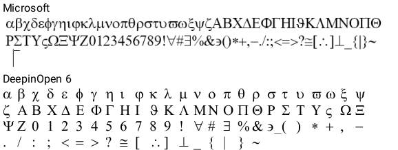
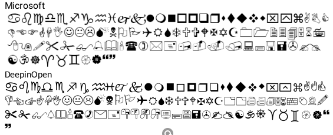
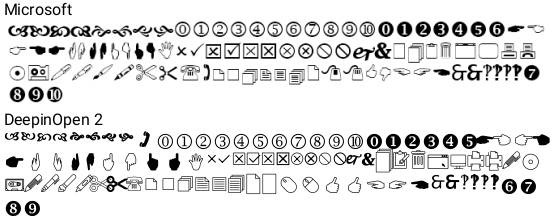
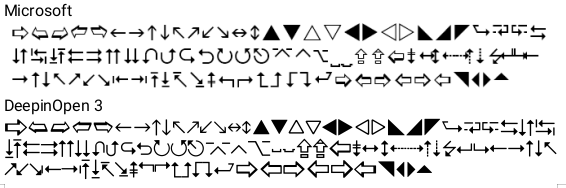
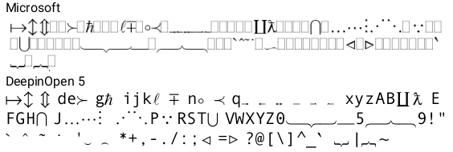
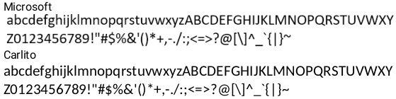
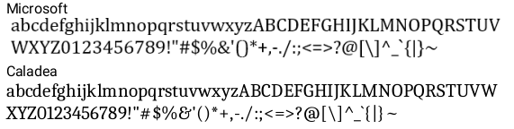

  <!-- /\* Font Definitions \*/ @font-face {font-family:SimSun; panose-1:2 1 6 0 3 1 1 1 1 1;} @font-face {font-family:"Cambria Math"; panose-1:2 4 5 3 5 4 6 3 2 4;} @font-face {font-family:Calibri; panose-1:2 15 5 2 2 2 4 3 2 4;} @font-face {font-family:Roboto; panose-1:2 0 0 0 0 0 0 0 0 0;} @font-face {font-family:sans-serif;} @font-face {font-family:"\\@SimSun"; panose-1:2 1 6 0 3 1 1 1 1 1;} /\* Style Definitions \*/ p.MsoNormal, li.MsoNormal, div.MsoNormal {margin:0in; font-size:10.0pt; font-family:"Calibri",sans-serif;} h3 {margin-right:0in; margin-left:0in; font-size:13.5pt; font-family:SimSun; font-weight:bold;} h4 {margin-right:0in; margin-left:0in; font-size:12.0pt; font-family:SimSun; font-weight:bold;} a:link, span.MsoHyperlink {color:blue; text-decoration:underline;} p {margin-right:0in; margin-left:0in; font-size:12.0pt; font-family:"Times New Roman",serif;} code {font-family:"Courier New";} pre {margin:0in; margin-bottom:.0001pt; font-size:12.0pt; font-family:SimSun;} .MsoChpDefault {font-size:10.0pt;} @page WordSection1 {size:595.3pt 841.9pt; margin:1.0in 1.25in 1.0in 1.25in;} div.WordSection1 {page:WordSection1;} /\* List Definitions \*/ ol {margin-bottom:0in;} ul {margin-bottom:0in;} -->

Link download file:  [https://github.com/tranhoangnam712/wps-bug-ubuntu-fonts/blob/main/fix-wps.sh](https://github.com/tranhoangnam712/wps-bug-ubuntu-fonts/blob/main/fix-wps.sh)

Script này có thể tự tải wps ,fix bug và cài font bản quyền hoặc font open source tùy người dùng

SOURCE CODE

#!/bin/bash

RED='\\e\[31m'

GREEN='\\e\[32m'

YELLOW='\\e\[33m'

RESET='\\e\[0m'

fake\_metadata(){

                local name="$1"

                shift

                echo -n "Forging ${name}..."

                while \[\[ "$#" -gt 0 \]\]; do

                                sudo sed -i "$1" "${name}.ttx" >/dev/null 2>&1

                                shift

                done

                sudo ttx -o "${name}.ttf" "${name}.ttx" >/dev/null 2>&1

                echo -e " | ${GREEN}Success${RESET}"

}

handler(){

    local RETRY\_ATTEMP=3

    local MSG="$1"

    local CMD="$2"

    local ERR\_MSG="$3"

    local SHOW\_OUTPUT="$4"

    local EXEC\_CMD="$CMD"

    if \[\[ -z "${SHOW\_OUTPUT}" \]\]; then

        EXEC\_CMD="$CMD >/dev/null 2>&1"

        echo -n "${MSG}..."

    else

        echo "${MSG}..." # Prints normally with a newline so apt gets its own space

    fi

    while ! eval "$EXEC\_CMD"; do

        ((RETRY\_ATTEMP--))

        echo -e "\\n--- $CMD | ${RED}Failed${RESET}\\nRetrying..."

        if \[\[ "$RETRY\_ATTEMP" -lt 1 \]\];then

            echo -e "${RED}${ERR\_MSG}, exit in 3 seconds${RESET}"

            sleep 3

            exit 1

        fi

        sleep 3

    done

    echo -e " | ${GREEN}Success${RESET}"

    return 0

}

sudo killall -9 wps >/dev/null 2>&1

sudo killall -9 wpp >/dev/null 2>&1

sudo killall -9 et >/dev/null 2>&1

sudo killall -9 wpspdf >/dev/null 2>&1

CURRENT\_PATH=$(pwd)

handler "Running apt update" "sudo apt update" "Pls recheck your network connection"

handler "Downloading package" "sudo apt install curl wget git meson ninja-build build-essential fcitx5 fcitx5-unikey fcitx5-frontend-qt5 fcitx5-frontend-gtk3 jq -y" "Pls recheck your network connection"

handler "Downloading freetype2.13.0 source code" "sudo wget -q -O freetype-2.13.0.tar.xz https://sourceforge.net/projects/freetype/files/freetype2/2.13.0/freetype-2.13.0.tar.xz" "Cant access to https://sourceforge.net/projects/freetype/files/freetype2/2.13.0/freetype-2.13.0.tar.xz .Pls recheck your network connection"

sudo tar xf freetype-2.13.0.tar.xz --remove-files >/dev/null 2>&1

handler "Extracting latest verion number..." "sudo curl -Ls https://params.wps.com/api/map/web/newwpsapk?pttoken=newlinuxpackages" "Pls recheck your network connection"

URL\_DOWNLOAD=$(sudo curl -Ls https://params.wps.com/api/map/web/newwpsapk?pttoken=newlinuxpackages | jq -r ".staticjs.website.wpsnewpackages.downloads" | base64 -d | jq -r ".linux\_deb")

LATEST\_VERSION="$(echo ${URL\_DOWNLOAD}| grep -oE "\[0-9\]+\\.\[0-9\]+\\.\[0-9\]+\\.\[0-9\]+")"

echo "Latest Version:${LATEST\_VERSION}"

OPTION=0

if dpkg -s "wps-office" >/dev/null 2>&1 ;then

                read -p "WPS already installed, do you want to reinstall(y/n):" REINSTALL

                if \[\[ "$REINSTALL" == "y" \]\]; then

                                handler "Deleting WPS" "sudo apt purge wps-office -y >/dev/null 2>&1 && sudo apt autoremove -y >/dev/null 2>&1" "Cant remove wps-office"

                                handler "Clearing all WPS cache and user data" "sudo rm -rf ~/.cache/Kingsoft ~/.config/Kingsoft ~/.local/share/Kingsoft /tmp/Kingsoft\* /opt/kingsoft/wps-office" "Failed to clear WPS data"

                else

                                OPTION=-1

                fi

fi

if \[\[ "${OPTION}" -eq 0 \]\];then

                echo "Finding local wps deb..."

                PATH\_DEB=$(find ./ ~/Downloads ~/Desktop -maxdepth 1 -name "wps-office\*.deb" 2>/dev/null)

                readarray -t ITEMS <<<"$PATH\_DEB"

                NEW=()

                for item in "${ITEMS\[@\]}"; do

                                if \[\[ "$(dpkg-deb -f "$item" Package 2> /dev/null)" == "wps-office" \]\];then

                                                NEW+=("${item}")

                                fi

                done

                NEW\_VERSION=()

                count=0

                if \[\[ "${#NEW\[@\]}" -ge 1 \]\];then

                                echo "Found ${#NEW\[@\]} wps deb file"

                                for item in "${NEW\[@\]}"; do

                                                ((count++))

                                                CURRENT\_VERSION=$(dpkg-deb -f "$item" Version 2> /dev/null | grep -oE "\[0-9\]+\\.\[0-9\]+\\.\[0-9\]+\\.\[0-9\]+")

                                                NEW\_VERSION+=("${CURRENT\_VERSION}")

                                                echo "${count}===${CURRENT\_VERSION} ${item}"

                                done

                                ((count++))

                                if \[\[ "${#NEW\[@\]}" -eq 1 && "${CURRENT\_VERSION\[0\]}" == "$LATEST\_VERSION" \]\];then

                                                OPTION=1

                                else

                                                echo "${count}===Download lastest version from internet"

                                                read -p "Do you want to install by one of those local or install with latest version in internet(1-${count}):" OPTION

                                fi

                else

                                OPTION=1

                                count=1

                fi

                while \[\[ "${OPTION}" -lt 1 || "${OPTION}" -gt "${count}" \]\];do

                                read -p "Invalid option,pls retry:" OPTION

                done

                if \[\[ "${OPTION}" -eq "${count}" \]\];then

                                handler "Downloading latest WPS from internet" "wget -q -O wps-${LATEST\_VERSION}.deb ${URL\_DOWNLOAD}" "Pls recheck your network connection"

                                DEB\_FILE="./wps-${LATEST\_VERSION}.deb"

                else

                                DEB\_FILE="${NEW\[--OPTION\]}"

                fi

                handler "Installing WPS-${LATEST\_VERSION}" "sudo apt install ${DEB\_FILE} -y" "Failed to install WPS" "show"

fi

echo "Fixing WPS bug"

cd freetype-2.13.0 >/dev/null 2>&1

handler "Compiling old version freetype" "meson setup build >/dev/null 2>&1 && meson compile -C build >/dev/null 2>&1" "Failed to compile freetype"

handler "Applying freetype to WPS" "sudo cp -a build/libfreetype.so\* /opt/kingsoft/wps-office/office6/" "Applying failed"

cd "${CURRENT\_PATH}" >/dev/null 2>&1

sudo rm -rf ./freetype-2.13.0 >/dev/null 2>&1

handler "Fixing export bug (libtiff.so.5 missing)" "sudo ln -s /usr/lib/x86\_64-linux-gnu/libtiff.so.6 /usr/lib/x86\_64-linux-gnu/libtiff.so.5" "Failed to link libtiff"

echo "Installing missing fonts"

handler "Install Roboto fonts" "sudo apt install fonts-roboto -y" "Pls recheck your network connection"

handler "Install Open Sans" "sudo apt install fonts-open-sans -y" "Pls recheck your network connection"

handler "Install Dejavu And Liberation2" "sudo apt install fonts-dejavu fonts-liberation2 -y" "Pls recheck your network connection"

echo -e "Personal:will applying fonts from microsoft and it violate copyright"

echo -e "Bussiness:will applying open source fonts.But cambria math fonts wont work"

read -p "Personal use(1) or Bussiness use(2):" OPTION

while \[\[ "$OPTION" != 1 && "$OPTION" != 2 \]\];do

                read -p "Invalid option,retry:" OPTION

done

sudo rm -rf /usr/share/fonts/truetype/microsoft >/dev/null 2>&1

sudo rm -rf /usr/share/fonts/truetype/open-source >/dev/null 2>&1

if \[\[ "$OPTION" -eq 1 \]\]; then

                sudo rm -rf ./wps-fonts >/dev/null 2>&1

                sudo rm -rf ./Windows-10-Fonts-Default >/dev/null 2>&1

                handler "Downloading microsoft fonts" "sudo git clone https://github.com/udoyen/wps-fonts.git >/dev/null 2>&1 && sudo git clone https://github.com/taveevut/Windows-10-Fonts-Default.git >/dev/null 2>&1" "Pls recheck your network connection"

                sudo rm -f ./wps-fonts/wps/WEBDINGS.TTF >/dev/null 2>&1

                sudo mv ./wps-fonts/wps/WINGDNG3.ttf ./wps-fonts/wps/wingding3.ttf >/dev/null 2>&1

                sudo mv ./wps-fonts/wps/WINGDNG2.ttf ./wps-fonts/wps/wingding2.ttf >/dev/null 2>&1

                handler "Creating folder" "sudo mkdir -p /usr/share/fonts/truetype/microsoft" "Failed to create folder"

                handler "Applying fonts" "sudo mv ./wps-fonts/wps/\* /usr/share/fonts/truetype/microsoft/ && sudo mv ./Windows-10-Fonts-Default/calibri.ttf /usr/share/fonts/truetype/microsoft/ && sudo mv ./Windows-10-Fonts-Default/calibrib.ttf /usr/share/fonts/truetype/microsoft/ && sudo mv ./Windows-10-Fonts-Default/calibrii.ttf /usr/share/fonts/truetype/microsoft/ && sudo mv ./Windows-10-Fonts-Default/calibriz.ttf /usr/share/fonts/truetype/microsoft/ && sudo mv ./Windows-10-Fonts-Default/calibril.ttf /usr/share/fonts/truetype/microsoft/ && sudo mv ./Windows-10-Fonts-Default/calibrili.ttf /usr/share/fonts/truetype/microsoft/ && sudo mv ./Windows-10-Fonts-Default/cambria.ttc /usr/share/fonts/truetype/microsoft/ && sudo mv ./Windows-10-Fonts-Default/cambriab.ttf /usr/share/fonts/truetype/microsoft/ && sudo mv ./Windows-10-Fonts-Default/cambriai.ttf /usr/share/fonts/truetype/microsoft/ && sudo mv ./Windows-10-Fonts-Default/cambriaz.ttf /usr/share/fonts/truetype/microsoft/" "Fonts apply failed"

                sudo rm -rf ./wps-fonts >/dev/null 2>&1

                sudo rm -rf ./Windows-10-Fonts-Default >/dev/null 2>&1

else

                handler "Creating folder" "sudo mkdir -p /usr/share/fonts/truetype/open-source" "Failed to create folder"

                handler "Installing fonttools" "sudo apt install fonttools -y" "Pls recheck your network connection"

                handler "Downloading Deepin" "sudo wget -q -O ttf-deepin-opensymbol\_2.2\_all.deb https://tux.rainside.sk/deepin/apricot/pool/non-free/t/ttf-deepin-opensymbol/ttf-deepin-opensymbol\_2.2\_all.deb" "Pls recheck your network connection"

                handler "Downloading Carlito(Replacement for Calibri)" "sudo apt install fonts-crosextra-carlito -y" "Pls recheck your network connection"

                handler "Downloading Caladea(Replacement for Cambria)" "sudo apt install fonts-crosextra-caladea -y" "Pls recheck your network connection"

                sudo dpkg-deb -x ttf-deepin-opensymbol\_2.2\_all.deb extracted\_fonts >/dev/null 2>&1

                sudo rm -f ./ttf-deepin-opensymbol\_2.2\_all.deb >/dev/null 2>&1

                cd extracted\_fonts/usr/share/fonts/truetype/deepin/ >/dev/null 2>&1

                echo "Decompiling to XML..."

                sudo ttx -o "wingding.ttx" DeepinOpenSymbol.ttf > /dev/null 2>&1

                sudo ttx -o "wingding2.ttx" DeepinOpenSymbol2.ttf > /dev/null 2>&1

                sudo ttx -o "wingding3.ttx" DeepinOpenSymbol3.ttf > /dev/null 2>&1

                sudo ttx -o "mtextra.ttx" DeepinOpenSymbol5.ttf > /dev/null 2>&1

                sudo ttx -o "symbol.ttx" DeepinOpenSymbol6.ttf > /dev/null 2>&1

                sudo rm -rf ./\*.ttf >/dev/null 2>&1

                cd /usr/share/fonts/truetype/crosextra/ >/dev/null 2>&1

                sudo ttx -o "calibri.ttx" Carlito-Regular.ttf > /dev/null 2>&1

                sudo ttx -o "calibrib.ttx" Carlito-Bold.ttf > /dev/null 2>&1

                sudo ttx -o "calibrii.ttx" Carlito-Italic.ttf > /dev/null 2>&1

                sudo ttx -o "calibriz.ttx" Carlito-BoldItalic.ttf > /dev/null 2>&1

                sudo ttx -o "cambria.ttx" Caladea-Regular.ttf > /dev/null 2>&1

                sudo ttx -o "cambriab.ttx" Caladea-Bold.ttf > /dev/null 2>&1

                sudo ttx -o "cambriai.ttx" Caladea-Italic.ttf > /dev/null 2>&1

                sudo ttx -o "cambriaz.ttx" Caladea-BoldItalic.ttf > /dev/null 2>&1

                sudo rm -rf ./\*.ttf >/dev/null 2>&1

                echo "Forging metadata to trick WPS"

                cd "${CURRENT\_PATH}/extracted\_fonts/usr/share/fonts/truetype/deepin/" >/dev/null 2>&1

                rules=("s/Deepin OpenSymbol Regular/Wingdings/g" "s/DeepinOpenSymbolRegular/Wingdings/g")

                fake\_metadata "wingding" "${rules\[@\]}"

                rules=("s/Deepin OpenSymbol 2/Wingdings 2/g" "s/DeepinOpenSymbol2Regular/Wingdings2/g")

                fake\_metadata "wingding2" "${rules\[@\]}"

                rules=("s/Deepin OpenSymbol 3/Wingdings 3/g" "s/DeepinOpenSymbol3Regular/Wingdings3/g")

                fake\_metadata "wingding3" "${rules\[@\]}"

                rules=("s/Deepin OpenSymbol 5 Regular/MT Extra/g" "s/DeepinOpenSymbolRegular5/MTExtra/g")

                fake\_metadata "mtextra" "${rules\[@\]}"

                rules=("s/Deepin OpenSymbol 6 Regular/Symbol/g" "s/DeepinOpenSymbolRegular6/Symbol/g")

                fake\_metadata "symbol" "${rules\[@\]}"

                cd /usr/share/fonts/truetype/crosextra/ >/dev/null 2>&1

                rules=("s/Carlito Regular/Calibri/g" "s/Carlito-Regular/Calibri/g" "s/Carlito/Calibri/g")

                fake\_metadata "calibri" "${rules\[@\]}"

                rules=("s/Carlito Bold/Calibri Bold/g" "s/Carlito-Bold/Calibri-Bold/g" "s/Carlito/Calibri/g")

                fake\_metadata "calibrib" "${rules\[@\]}"

                rules=("s/Carlito Italic/Calibri Italic/g" "s/Carlito-Italic/Calibri-Italic/g" "s/Carlito/Calibri/g")

                fake\_metadata "calibrii" "${rules\[@\]}"

                rules=("s/Carlito Bold Italic/Calibri Bold Italic/g" "s/Carlito-BoldItalic/Calibri-BoldItalic/g" "s/Carlito/Calibri/g")

                fake\_metadata "calibriz" "${rules\[@\]}"

                rules=("s/Caladea Regular/Cambria/g" "s/Caladea-Regular/Cambria/g" "s/Caladea/Cambria/g")

                fake\_metadata "cambria" "${rules\[@\]}"

                rules=("s/Caladea Bold/Cambria Bold/g" "s/Caladea-Bold/Cambria-Bold/g" "s/Caladea/Cambria/g")

                fake\_metadata "cambriab" "${rules\[@\]}"

                rules=("s/Caladea Italic/Cambria Italic/g" "s/Caladea-Italic/Cambria-Italic/g" "s/Caladea/Cambria/g")

                fake\_metadata "cambriai" "${rules\[@\]}"

                rules=("s/Caladea Bold Italic/Cambria Bold Italic/g" "s/Caladea-BoldItalic/Cambria-BoldItalic/g" "s/Caladea/Cambria/g")

                fake\_metadata "cambriaz" "${rules\[@\]}"

                handler "Applying fonts" "sudo mv ${CURRENT\_PATH}/extracted\_fonts/usr/share/fonts/truetype/deepin/\*.ttf /usr/share/fonts/truetype/open-source/ && sudo mv /usr/share/fonts/truetype/crosextra/\*.ttf /usr/share/fonts/truetype/open-source/" "Apply fonts failed"

                cd "${CURRENT\_PATH}" >/dev/null 2>&1

                sudo rm -rf ./extracted\_fonts >/dev/null 2>&1

                sudo rm -rf /usr/share/fonts/truetype/crosextra >/dev/null 2>&1

                sudo apt reinstall fonts-crosextra-carlito -y >/dev/null 2>&1

                sudo apt reinstall fonts-crosextra-caladea -y >/dev/null 2>&1

                sudo apt purge fonts-crosextra-carlito -y >/dev/null 2>&1

                sudo apt purge fonts-crosextra-caladea -y >/dev/null 2>&1

                sudo apt autoremove -y >/dev/null 2>&1

fi

handler "Reseting fonts cache" "sudo fc-cache -fvs >/dev/null 2>&1" "Failed to reset cache"

\# read -p "Do you want to install fcitx5 and Unikey(y/n):" OPTION

\# while \[\[ ! "${OPTION}" == "y" && ! "${OPTION}" == "n" \]\];do

\#             read -p "Invalid option,retry:" OPTION

\# done

\# if \[\[ "${OPTION}" == "y" \]\];then

#             handler "Installing fcitx5 and Unikey" "im-config -n fcitx5 && echo -e \\"\\nexport GTK\_IM\_MODULE=fcitx\\nexport QT\_IM\_MODULE=fcitx\\nexport XMODIFIERS=@im=fcitx\\" >> ~/.profile" "Applying fcitx5 and Unikey failed"

\# fi

read -p "Completed,reboot now? y/n:" REBOOT

if \[\[ "${REBOOT}" == "y" \]\];then

                sudo reboot

fi

  

Hướng dẫn sử dụng

save code above into wps-fix.sh

Run

chmod 777 wps-fix.sh

./wps-fix.sh

Lưu ý, code này không sửa được hết bug ,còn 1 bug cần được sửa thủ công,đó là bug không chạy được video nhúng trên slide pptx.

**Danh s****ách bug và cách sửa lỗi**

1.   Bug ko chạy được video nhúng trong pptx

Cách sửa:

  

2.Bug fonts rendering

Nguyên nhân: do wps sử dụng thư viện freetype mới nhất nên bị lỗi khi rendering 1 số fonts.Lỗi này xảy ra khi có font chữ không có được thiết kế font Bold ,và wps phải fake bold .Những font chữ có thiết kế font Bold sẽ không bị.  

Cách sửa :

Downgrade thư viện freetype xuống phiên bản 2.13.0

Package cần thiết

sudo apt install meson ninja-build build-essential

Tải thư viện freetype và giải nén

sudo wget -q -O freetype-2.13.0.tar.xz [https://sourceforge.net/projects/freetype/files/freetype2/2.13.0/freetype-2.13.0.tar.xz](https://sourceforge.net/projects/freetype/files/freetype2/2.13.0/freetype-2.13.0.tar.xz)

sudo tar xf freetype-2.13.0.tar.xz

compile thư viện

cd freetype-2.13.0

meson setup build && meson compile -C build

thay thế file thư viện đó qua trong file system của wps

sudo cp -a build/libfreetype.so\* /opt/kingsoft/wps-office/office6/

3\. Bug không export được ra PDF / hình ảnh (Thiếu thư viện libtiff)

Nguyên nhân: Trên Ubuntu 24.04 đã được nâng cấp lên thư viện libtiff.so.6 mới hơn, nhưng WPS Office vẫn tìm kiếm phiên bản cũ là libtiff.so.5 để thực hiện tính năng export.

Cách sửa:

Tạo một symlink (liên kết mềm) từ phiên bản 6 sang phiên bản 5 để đánh lừa WPS:

sudo ln -s /usr/lib/x86\_64-linux-gnu/libtiff.so.6 /usr/lib/x86\_64-linux-gnu/libtiff.so.5

**Các fonts chữ bị thiếu**

Fonts bản quyền:                                         Font open source thay thế:

Symbol                                   ->                                 Deepin Open Symbol 6

Wingdings                             \->                                 Deepin Open Symbol

Wingdings 2                          ->                                 Deepin Open Symbol 2

Wingding 3                            ->                                 Deepin Open Symbol 3

MT Extra                                ->                                 Deepin Open SYmbol 5

Calibri                                     \->                                 Carlito

Cambria                                 ->                                 Caladea

Fonts open source dùng chung cả 2 trường hợp:

Roboto

Open sans

Ưu điểm và nhược điểm:

Ưu điểm

Nhược điểm

Font bản quyền

Mọi font chữ và kích thước đều giống như phiên bản của office

Vi phạm bản quyền trừ khi laptop đó có bản quyền window

Font open source

Open source

Fonts chữ và kích thước giống tới 90% .1 số font và ký tự có thể sẽ bị khác với phiên bản office .Cambria Math không có giải pháp open source .Nên 1 số ký tự toán của cambria math sẽ không hiển thị đúng .

### 1\. Cách cài đặt Fonts chữ bản quyền (Microsoft Fonts)

Cách này tải trực tiếp các font mặc định của Windows và copy vào hệ thống Linux.

Bash

\# Tải font từ thư viện mã nguồn mở

    git 

    git 

\# Xử lý trùng lặp và đổi tên file đúng định dạng

    rm -f ./wps-fonts/wps/WEBDINGS.TTF

    mv ./wps-fonts/wps/WINGDNG3.ttf ./wps-fonts/wps/wingding3.ttf

    mv ./wps-fonts/wps/WINGDNG2.ttf ./wps-fonts/wps/wingding2.ttf

\# Tạo thư mục chứa font(symbol,wingding ,wingding2 ,wingding 3 ,mt extra) và di chuyển file vào hệ thống

    sudo mkdir -p /usr/share/fonts/truetype/microsoft

    sudo mv ./wps-fonts/wps/* /usr/share/fonts/truetype/microsoft/

\# Di chuyển các font phổ biến (Calibri, Cambria)

    sudo mv ./Windows-10-Fonts-Default/calibri*.ttf /usr/share/fonts/truetype/microsoft/

    sudo mv ./Windows-10-Fonts-Default/cambria*.ttf /usr/share/fonts/truetype/microsoft/

    sudo mv ./Windows-10-Fonts-Default/cambria.ttc /usr/share/fonts/truetype/microsoft/

\# Cập nhật lại cache font của hệ thống

    sudo fc-cache -fvs

### 2.Cách cài font Open Source thay thế bản quyền

#### Bước 1: Khởi tạo môi trường và tải các công cụ hỗ trợ

Hệ thống cần cài đặt `fonttools` để xử lý biên dịch ngược font và các gói font mã nguồn mở thay thế từ kho ứng dụng chính thức.

Bash

`# Tạo thư mục lưu trữ font open-source trên hệ thống`

`sudo mkdir -p /usr/share/fonts/truetype/open-source`

`# Cài đặt công cụ biên dịch font và các font thay thế (Carlito, Caladea)`

`sudo apt install fonttools fonts-crosextra-carlito fonts-crosextra-caladea -y`

`# Tải gói font ký tự độc quyền từ Deepin và giải nén thủ công`

`sudo wget -q -O ttf-deepin-opensymbol_2.2_all.deb https://tux.rainside.sk/deepin/apricot/pool/non-free/t/ttf-deepin-opensymbol/ttf-deepin-opensymbol_2.2_all.deb`

`sudo dpkg-deb -x ttf-deepin-opensymbol_2.2_all.deb extracted_fonts`

`# Xóa file cài đặt .deb sau khi đã giải nén xong`

`sudo rm -f ./ttf-deepin-opensymbol_2.2_all.deb`

#### Bước 2: Dịch ngược và giả mạo Metadata cho các Font ký tự

Chuyển đổi toàn bộ 5 font ký tự từ thư mục giải nén của Deepin sang định dạng cấu trúc XML (`.ttx`), thay đổi tên định danh bên trong cấu trúc file để đánh lừa ứng dụng, sau đó đóng gói lại về định dạng `.ttf`.

cd extracted\_fonts/usr/share/fonts/truetype/deepin/

\# 1. Chuyển đổi toàn bộ định dạng TTF sang TTX (XML)

sudo ttx -o "wingding.ttx" DeepinOpenSymbol.ttf > /dev/null 2>&1

sudo ttx -o "wingding2.ttx" DeepinOpenSymbol2.ttf > /dev/null 2>&1

sudo ttx -o "wingding3.ttx" DeepinOpenSymbol3.ttf > /dev/null 2>&1

sudo ttx -o "mtextra.ttx" DeepinOpenSymbol5.ttf > /dev/null 2>&1

sudo ttx -o "symbol.ttx" DeepinOpenSymbol6.ttf > /dev/null 2>&1

\# Xóa các file TTF gốc chưa chỉnh sửa

sudo rm -rf ./\*.ttf

\# 2. Tiến hành thay đổi tên định danh font (Font Forging) và đóng gói lại

\# Xử lý Wingdings

sudo sed -i "s/Deepin OpenSymbol Regular/Wingdings/g; s/DeepinOpenSymbolRegular/Wingdings/g" wingding.ttx

sudo ttx -o wingding.ttf wingding.ttx

\# Xử lý Wingdings 2

sudo sed -i "s/Deepin OpenSymbol 2/Wingdings 2/g; s/DeepinOpenSymbol2Regular/Wingdings2/g" wingding2.ttx

sudo ttx -o wingding2.ttf wingding2.ttx

\# Xử lý Wingdings 3

sudo sed -i "s/Deepin OpenSymbol 3/Wingdings 3/g; s/DeepinOpenSymbol3Regular/Wingdings3/g" wingding3.ttx

sudo ttx -o wingding3.ttf wingding3.ttx

\# Xử lý MT Extra

sudo sed -i "s/Deepin OpenSymbol 5 Regular/MT Extra/g; s/DeepinOpenSymbolRegular5/MTExtra/g" mtextra.ttx

sudo ttx -o mtextra.ttf mtextra.ttx

\# Xử lý Symbol

sudo sed -i "s/Deepin OpenSymbol 6 Regular/Symbol/g; s/DeepinOpenSymbolRegular6/Symbol/g" symbol.ttx

sudo ttx -o symbol.ttf symbol.ttx

\# Di chuyển các font ký tự đã mod thành công vào thư mục open-source

sudo mv ./\*.ttf /usr/share/fonts/truetype/open-source/

**Bước 3: Dịch ngược và đổi tên các Font văn bản chính (Carlito -> Calibri, Caladea -> Cambria)**

Chuyển đổi toàn bộ các biến thể (Regular, Bold, Italic, BoldItalic) của font văn bản chuẩn trong hệ thống để thực hiện tráo đổi định danh cấu trúc.

cd /usr/share/fonts/truetype/crosextra/

\# 1. Chuyển đổi toàn bộ định dạng TTF sang TTX (XML)

sudo ttx -o "calibri.ttx" Carlito-Regular.ttf > /dev/null 2>&1

sudo ttx -o "calibrib.ttx" Carlito-Bold.ttf > /dev/null 2>&1

sudo ttx -o "calibrii.ttx" Carlito-Italic.ttf > /dev/null 2>&1

sudo ttx -o "calibriz.ttx" Carlito-BoldItalic.ttf > /dev/null 2>&1

sudo ttx -o "cambria.ttx" Caladea-Regular.ttf > /dev/null 2>&1

sudo ttx -o "cambriab.ttx" Caladea-Bold.ttf > /dev/null 2>&1

sudo ttx -o "cambriai.ttx" Caladea-Italic.ttf > /dev/null 2>&1

sudo ttx -o "cambriaz.ttx" Caladea-BoldItalic.ttf > /dev/null 2>&1

\# Xóa các file TTF nguyên bản trong thư mục hiện hành

sudo rm -rf ./\*.ttf

\# 2. Xử lý sửa metadata và biên dịch lại cho nhóm font Calibri (Carlito)

sudo sed -i "s/Carlito Regular/Calibri/g; s/Carlito-Regular/Calibri/g; s/Carlito/Calibri/g" calibri.ttx

sudo ttx -o calibri.ttf calibri.ttx

sudo sed -i "s/Carlito Bold/Calibri Bold/g; s/Carlito-Bold/Calibri-Bold/g; s/Carlito/Calibri/g" calibrib.ttx

sudo ttx -o calibrib.ttf calibrib.ttx

sudo sed -i "s/Carlito Italic/Calibri Italic/g; s/Carlito-Italic/Calibri-Italic/g; s/Carlito/Calibri/g" calibrii.ttx

sudo ttx -o calibrii.ttf calibrii.ttx

sudo sed -i "s/Carlito Bold Italic/Calibri Bold Italic/g; s/Carlito-BoldItalic/Calibri-BoldItalic/g; s/Carlito/Calibri/g" calibriz.ttx

sudo ttx -o calibriz.ttf calibriz.ttx

\# 3. Xử lý sửa metadata và biên dịch lại cho nhóm font Cambria (Caladea)

sudo sed -i "s/Caladea Regular/Cambria/g; s/Caladea-Regular/Cambria/g; s/Caladea/Cambria/g" cambria.ttx

sudo ttx -o cambria.ttf cambria.ttx

sudo sed -i "s/Caladea Bold/Cambria Bold/g; s/Caladea-Bold/Cambria-Bold/g; s/Caladea/Cambria/g" cambriab.ttx

sudo ttx -o cambriab.ttf cambriab.ttx

sudo sed -i "s/Caladea Italic/Cambria Italic/g; s/Caladea-Italic/Cambria-Italic/g; s/Caladea/Cambria/g" cambriai.ttx

sudo ttx -o cambriai.ttf cambriai.ttx

sudo sed -i "s/Caladea Bold Italic/Cambria Bold Italic/g; s/Caladea-BoldItalic/Cambria-BoldItalic/g; s/Caladea/Cambria/g" cambriaz.ttx

sudo ttx -o cambriaz.ttf cambriaz.ttx

\# 4. Di chuyển toàn bộ font văn bản đã xử lý sang thư mục mục tiêu

sudo mv /usr/share/fonts/truetype/crosextra/\*.ttf /usr/share/fonts/truetype/open-source/

**3.****cài đặt fonts open source dùng chung cho cả 2 trường hợp**

Có 4 fonts nổi tiếng open source nhưng Ubuntu không tự cài sẵn,nên mình phải cài ,cho dù là trường hợp bản quyền hay open source thế bản quyền.

Install Roboto fonts

sudo apt install fonts-roboto

Install Open Sans

sudo apt install fonts-open-sans

Install Dejavu And Liberation2

sudo apt install fonts-dejavu fonts-liberation2

**Sự khác nhau giữa bản quyền và open source**

Open source hầu như chạy chính xác 90% so với fonts bản quyền.  
Một số ký tự hoặc ký hiệu sẽ có hình dạng khác 1 chút ,nhưng vẫn cùng 1 ý nghĩa ,cùng kích thước.

Chỉ có Fonts Cambria Math không có phiên bản open source thay thế

 Font Symbol:

Font Wingdings

  

 Font Wingdings 2

Font Wingdings 3

MT Extra

  
Calibri

Cambria

